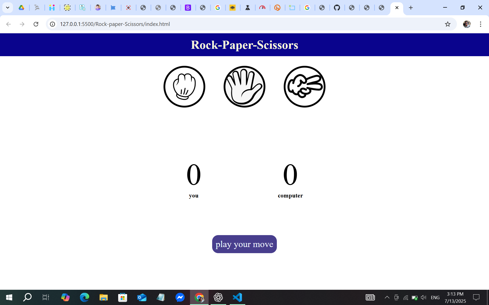
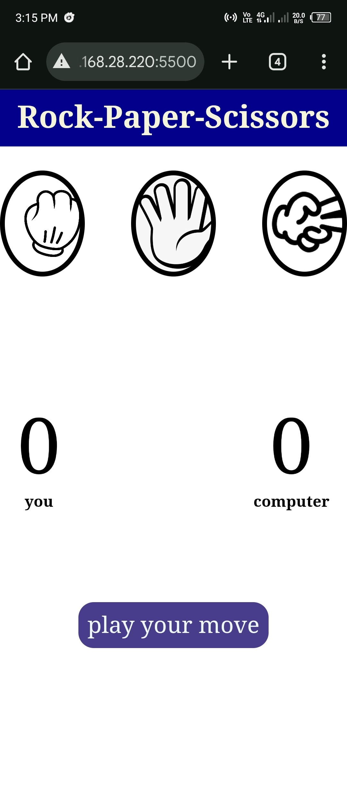

# ✊✋✌️ Rock-Paper-Scissors Game

🎮 A simple and fun **Rock-Paper-Scissors** game built with **HTML**, **CSS**, and **JavaScript**.  
Play against the computer and test your luck! 🔥

---

## 🕹️ How to Play
- 🧠 Click on one of the options: Rock, Paper, or Scissors.
- 🤖 The computer will randomly choose its move.
- 🏆 Rules:
  - 🪨 Rock beats ✂️ Scissors
  - ✂️ Scissors beats 📄 Paper
  - 📄 Paper beats 🪨 Rock

---

## 📸 Screenshots



---

## 🚀 Live Preview  
👉 [Play Now on GitHub Pages](https://nafis-cse.github.io/R-P-S_game/)

---

## 🛠️ Technologies Used
- 🌐 HTML5  
- 🎨 CSS3  
- 🧠 JavaScript (Vanilla)

---

## 📁 Project Structure


```
rock-paper-scissors/
├── index.html
├── style.css
├── script.js
├── rock.png
├── paper.png
├── scissors.png
├── README.md
└── screenshots/
├── desktop.png
└── mobile.png

```

---

## 🙋‍♂️ Author
👨‍💻 **Shahariyar Nafis**  
🔗 [GitHub Profile](https://github.com/nafis-cse)

---

## ⭐ Give it a Star!
If you like this project, consider giving it a ⭐ on GitHub!
